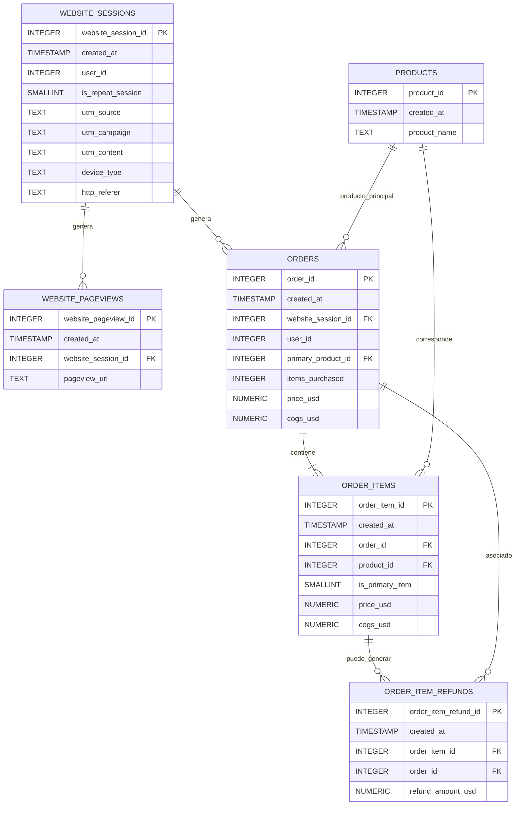

# Modelo de datos

El siguiente diagrama representa las principales relaciones entre las tablas utilizadas en el análisis.

```mermaid
erDiagram

    PRODUCTS {
        INTEGER product_id PK
        TIMESTAMP created_at
        TEXT product_name
    }

    WEBSITE_SESSIONS {
        INTEGER website_session_id PK
        TIMESTAMP created_at
        INTEGER user_id
        SMALLINT is_repeat_session
        TEXT utm_source
        TEXT utm_campaign
        TEXT utm_content
        TEXT device_type
        TEXT http_referer
    }

    WEBSITE_PAGEVIEWS {
        INTEGER website_pageview_id PK
        TIMESTAMP created_at
        INTEGER website_session_id FK
        TEXT pageview_url
    }

    ORDERS {
        INTEGER order_id PK
        TIMESTAMP created_at
        INTEGER website_session_id FK
        INTEGER user_id
        INTEGER primary_product_id FK
        INTEGER items_purchased
        NUMERIC price_usd
        NUMERIC cogs_usd
    }

    ORDER_ITEMS {
        INTEGER order_item_id PK
        TIMESTAMP created_at
        INTEGER order_id FK
        INTEGER product_id FK
        SMALLINT is_primary_item
        NUMERIC price_usd
        NUMERIC cogs_usd
    }

    ORDER_ITEM_REFUNDS {
        INTEGER order_item_refund_id PK
        TIMESTAMP created_at
        INTEGER order_item_id FK
        INTEGER order_id FK
        NUMERIC refund_amount_usd
    }

    WEBSITE_SESSIONS ||--o{ WEBSITE_PAGEVIEWS : genera
    WEBSITE_SESSIONS ||--o{ ORDERS : genera
    PRODUCTS ||--o{ ORDERS : producto_principal
    ORDERS ||--|{ ORDER_ITEMS : contiene
    PRODUCTS ||--o{ ORDER_ITEMS : corresponde
    ORDER_ITEMS ||--o{ ORDER_ITEM_REFUNDS : puede_generar
    ORDERS ||--o{ ORDER_ITEM_REFUNDS : asociado
```